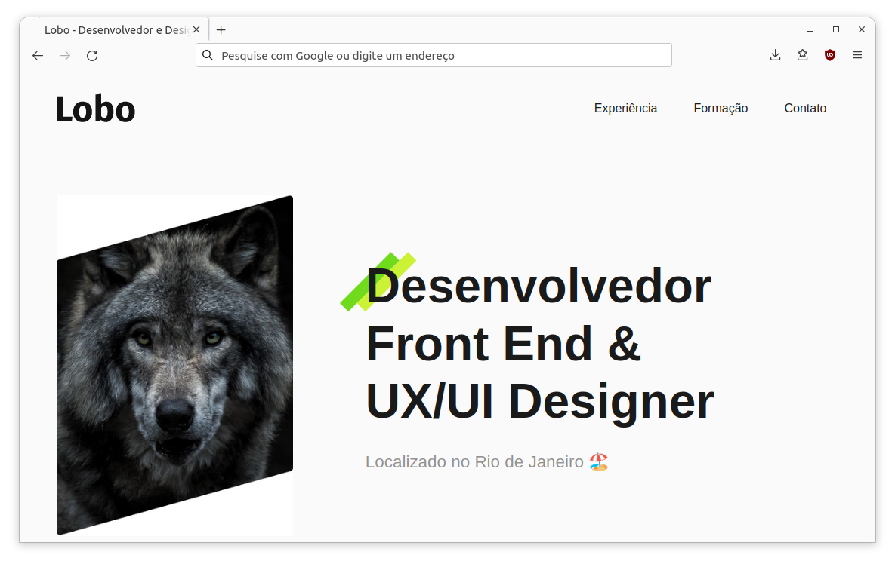

  
  <!-- PROJECT NAME
  --------------------------------------------------------------------->
  ## PROJETO LOBO (ORIGAMID)
  
   

  <!-- PROJECT IMAGE
  --------------------------------------------------------------------->  
  

  

<!-- PROJECT ABOUT
--------------------------------------------------------------------->
## 📝 Sobre
O design do projeto Lobo foi criado utilizando a ferramenta Figma, durante o curso de UI/UX Design, e então, foi desenvolvido durante o curso de HTML e CSS da Origamid.

<!-- PROJECT TECHS
--------------------------------------------------------------------->
  
## 💻 Linguagens Usadas

<!-- PROJECT CONTACT
--------------------------------------------------------------------->
  
## 😄 Contato
📫 Você pode me contatar em **allanld29@proton.me**

<!-- BACK
--------------------------------------------------------------------->
<h3 align="right"><a href="#top">⬆️</a></h3>
